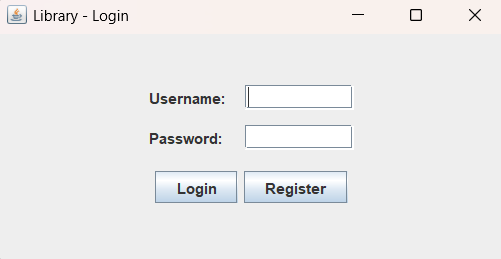
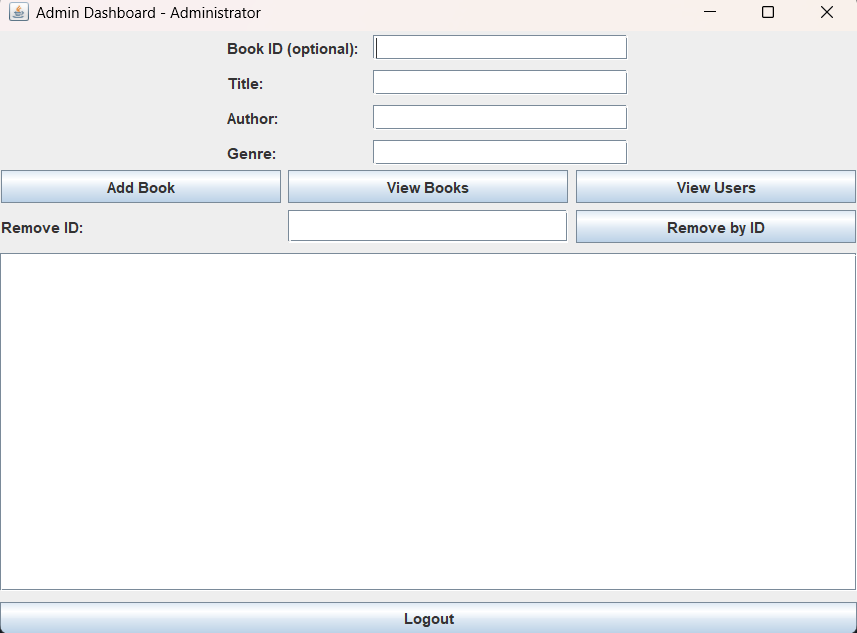
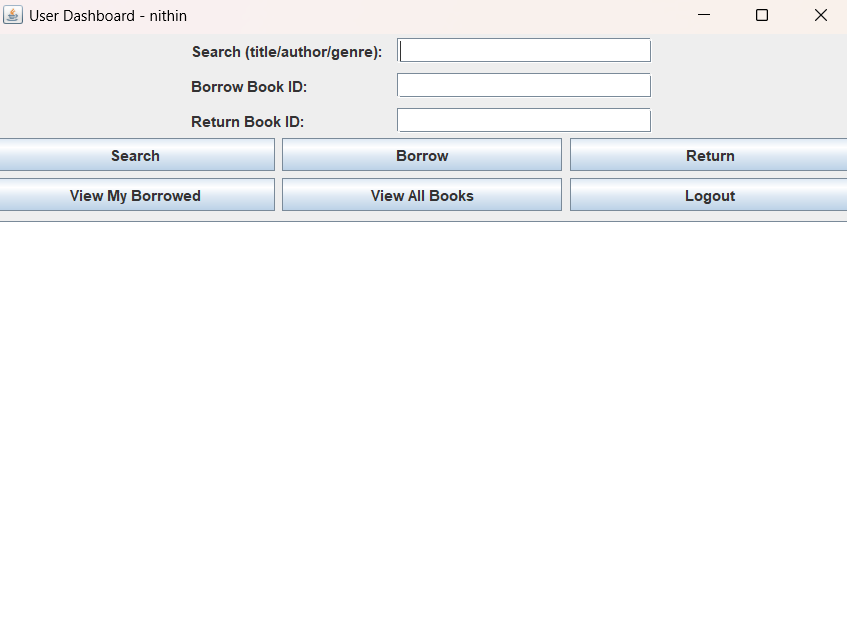

📚 Library Management System (Java Swing)

A simple Library Management System built with Java Swing in a single file.
It provides both Admin and User dashboards, allowing book management, borrowing, returning, and searching by title/author/genre.

✨ Features
👨‍💼 Admin Dashboard

Add new books to the library

View all available books

Remove books by ID

Manage library inventory

👤 User Dashboard

Search books by title, author, or genre

Borrow books using their Book ID

Return borrowed books

View available books

🛠️ Tech Stack

Language: Java

GUI: Swing (JFrame, JPanel, JTextField, JButton, etc.)

Data Storage: In-memory (no database)

🚀 How to Run

Clone or download this repository

git clone https://github.com/your-username/library-management-system.git
cd library-management-system

Compile the project:

javac LibrarySystem.java

Run the project:

java LibrarySystem

📸 Screenshots
Login Page

Admin Dashboard

User Dashboard

🔮 Future Improvements

Add a database (MySQL / SQLite) for persistent storage

Implement user authentication with password protection

Add book due dates and fine calculation

👨‍💻 Author

Nithin Amaraneni